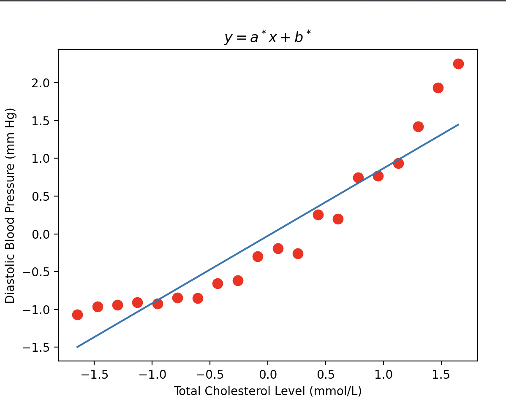

This one is more stable for gradient descent than the linear data.
I can change the initial conditions much more while still getting
a reasonable line to match the data. However, a line is not a good
fit for this non-linear data. 
This one has curve so gradient descent has something to follow. Hence, 
finding a solution is more stable.
The relationship between cholesterol levels and blood pressure is curved, 
this means that blood pressure increases slowly when cholesterol is low, 
but then rises more when cholesterol is high . 
Because of this curve, using a straight-line model is ineffective. Because the straight
line cannot follow the curve's steep changes and will result in inaccurate predictions,
especially for people with very high or very low cholesterol.

