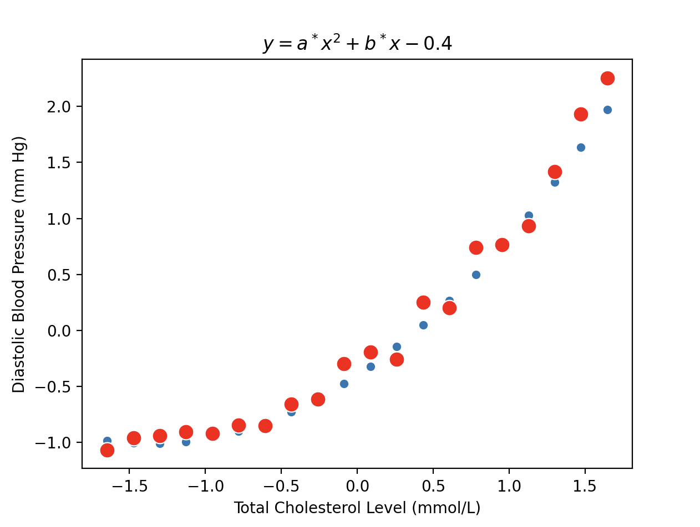

Since the data has a curved relationship (non-linear data), 
I think we should use a quadratic function.
I could implement a change to the target function g such as a second
order polynomial rather than a first order polynomial (line) so that
the function has a curve to better match the data. 

So our new g will be f(x) =  ax^2 + bx - 0.4
We use -0.4 for c so we only have to solve for a and b.
I picked -0.4 for c because after scaling the data the y
value that corresponds to x = 0 was approximetly -0.4 
(y intercept) which would be the correct value for c.

Now it looks like a very good match to the data!!!